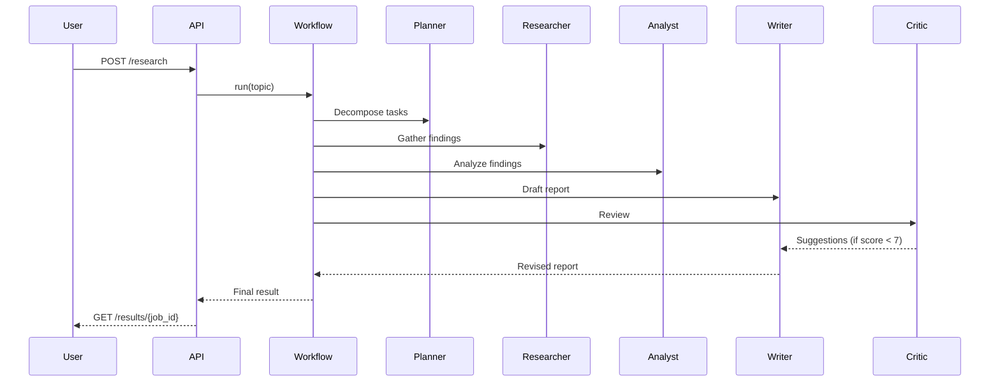

# Multi-Agent Research Workflow

A production-ready, Python-based framework for automating deep research using a **pipeline of specialised AI agents**. Each agent owns a single responsibility — planning, researching, analysing, writing, and critiquing — and hands its output to the next stage through a shared state bus. The whole pipeline is orchestrated by a YAML-driven workflow engine with retry logic, a REST API, a WebSocket progress feed, and an optional Streamlit UI.



---

## Table of Contents

- [Architecture overview](#architecture-overview)
- [AI methods and techniques used](#ai-methods-and-techniques-used)
- [Agent roster](#agent-roster)
- [Project structure](#project-structure)
- [Quick start](#quick-start)
- [Configuration and API keys](#configuration-and-api-keys)
- [Running the REST API](#running-the-rest-api)
- [Running the Streamlit UI](#running-the-streamlit-ui)
- [Running with Docker](#running-with-docker)
- [Writing custom agents and workflows](#writing-custom-agents-and-workflows)
- [Running tests](#running-tests)
- [Tech stack](#tech-stack)
- [Roadmap](#roadmap)

---

## Architecture overview

```
User / API
    │
    ▼
┌───────────────────────────────────────────────────────────┐
│  Workflow engine  (orchestrator/workflow.py)               │
│  · Reads a YAML step definition                           │
│  · Resolves step dependencies & payload mapping           │
│  · Calls Scheduler for retry / timeout logic              │
└───────────────┬───────────────────────────────────────────┘
                │  routes tasks to
                ▼
┌───────────────────────────────────────────────────────────┐
│  Router  (orchestrator/router.py)                         │
│  Resolves agent name → Agent instance (with tools)        │
└───────────────┬───────────────────────────────────────────┘
                │
        ┌───────┴──────────────────────────────────┐
        │  Agents (each isolated, no direct calls)  │
        │  Planner → Researcher → Analyst            │
        │                    → Writer → Critic       │
        │                         ↑ (revise loop)    │
        └───────────────────────────────────────────┘
                │ each agent reads/writes
                ▼
┌───────────────────────────────────────────────────────────┐
│  SharedState  (orchestrator/state.py)                     │
│  Async-safe key-value store + structured audit log        │
└───────────────────────────────────────────────────────────┘
```

Agents communicate **exclusively through `SharedState`** and typed `AgentResult` objects — they never call each other directly. This keeps the graph acyclic and every step independently testable.

---

## AI methods and techniques used

### 1. Multi-agent pipeline (Agentic workflow)

The system implements a **directed acyclic graph (DAG) of specialised agents** — a pattern sometimes called a *compound AI system* or *agentic workflow*. Each agent is an autonomous unit that runs a `think → act → reflect` loop and returns a typed `AgentResult`. The pattern is inspired by *ReAct* (Reason + Act) and *Reflexion* (self-reflection after acting).

### 2. Role-specialised system prompting

Each agent carries a dedicated `system_prompt` that constrains its behaviour to a single role (planner, researcher, analyst, writer, critic). Separating concerns this way improves output quality compared to a single general-purpose prompt because each role can be tuned and tested independently.

### 3. Tool-augmented agents (ReAct-style)

Agents can call external **tools** at runtime through a uniform `act(tool_name, **kwargs)` interface:

| Tool | What it does |
|---|---|
| `WebSearchTool` | Queries Tavily or SerpAPI; falls back to a deterministic mock |
| `WebScraperTool` | Fetches a URL and extracts clean body text with BeautifulSoup |
| `SummarizerTool` | Extractive or abstractive summarisation of arbitrary text |
| `CalculatorTool` | Safe AST-based arithmetic + descriptive statistics (mean/median/std) |
| `FileWriterTool` | Persists outputs (Markdown reports) to the filesystem |

Tool calls are mediated by the base `Agent.act()` method, making it trivial to add new tools or swap implementations (real API ↔ mock) via a single environment variable.

### 4. Source credibility scoring

The `ResearcherAgent` assigns a credibility score to each source URL based on its top-level domain (`.gov` / `.edu` → 0.95, `.org` / `.com` → 0.75, other → 0.50). This is a lightweight form of **knowledge provenance tracking** that lets downstream agents and the critic weight evidence appropriately.

### 5. Self-critique and iterative revision loop

After the `WriterAgent` produces a draft, the `CriticAgent` scores it (0–10) and emits structured feedback (`issues`, `suggestions`, `approved`). If the score falls below the acceptance threshold, the workflow re-invokes the `WriterAgent` with the critic's suggestions — a **self-refinement loop** that improves report quality without human intervention.

### 6. Lightweight semantic memory (VectorMemory)

`VectorMemory` stores text chunks with a 3-dimensional character-frequency embedding and retrieves the top-k most similar chunks using **cosine similarity** combined with **keyword-overlap re-ranking**. While intentionally simple (no heavy ML dependency), the interface is drop-in replaceable with a real embedding model (e.g. `sentence-transformers`) or a vector database (Chroma, Qdrant, Pinecone).

### 7. Sliding-window conversation memory

Each agent maintains a **sliding-window conversation buffer** (`ConversationMemory`, configurable max messages) so that the agent's think/reflect steps can reference recent context without unbounded memory growth.

### 8. Async-safe shared state with audit log

`SharedState` is an **asyncio lock-protected key-value store** with a timestamped audit log. Every agent write and reflect action is recorded, giving full observability into what each agent did and when — essential for debugging multi-agent pipelines.

### 9. Exponential back-off retry

The `Scheduler` wraps every agent call in an `asyncio.wait_for` timeout with up to 3 attempts and **exponential back-off** (1 s, 2 s, 4 s) with structured logging on each retry. This makes the pipeline resilient to transient failures in external APIs.

### 10. Declarative YAML workflow composition

Workflows are defined as YAML files, not code. Each step declares its agent, output key, and optional conditions. This **declarative workflow pattern** (similar to LangGraph or Prefect) lets you add, remove, or reorder pipeline stages without touching Python source.

---

## Agent roster

| Agent | Role | Key output fields |
|---|---|---|
| **PlannerAgent** | Decomposes a topic into an ordered DAG of subtasks | `task_plan` → `subtasks[]` |
| **ResearcherAgent** | Web search + scrape + credibility-rank sources | `research_findings` → `key_points`, `sources`, `raw_data` |
| **AnalystAgent** | Synthesise findings into insights, comparisons, and gap analysis | `analysis` → `insights`, `comparisons`, `gaps` |
| **WriterAgent** | Renders a structured Markdown research report | `draft_report` / `final_report` → `report` |
| **CriticAgent** | Scores the draft (0–10) and emits actionable suggestions | `review` → `score`, `issues`, `suggestions`, `approved` |

---

## Project structure

```
multi-agent-research/
├── src/
│   ├── agents/         # Agent implementations (planner, researcher, analyst, writer, critic)
│   ├── api/            # FastAPI app, REST routes, Pydantic schemas, WebSocket handler
│   ├── config.py       # Pydantic settings + .env loading (dotenv)
│   ├── llm/            # LLM provider abstraction, prompt registry, structured output helpers
│   ├── memory/         # ConversationMemory, SharedMemory, VectorMemory
│   ├── orchestrator/   # Workflow engine, agent router, retry scheduler, shared state
│   ├── tools/          # Tool implementations (web search, scraper, summariser, calculator, file writer)
│   └── ui/             # Streamlit demo UI
├── workflows/          # YAML workflow definitions
│   ├── research_report.yaml
│   ├── competitive_analysis.yaml
│   └── literature_review.yaml
├── examples/           # Runnable standalone scripts
├── tests/              # Pytest test suite (agents, tools, memory, orchestrator, API)
├── outputs/            # Generated reports (git-ignored)
├── docs/               # Architecture and design docs
├── .env.example        # Template for all environment variables
├── docker-compose.yml
├── Makefile
└── requirements.txt
```

---

## Quick start

### 1. Clone and install

```bash
git clone https://github.com/your-username/multi-agent-research.git
cd multi-agent-research/multi-agent-research
pip install -r requirements.txt
```

### 2. Configure environment

```bash
cp .env.example .env
# For a fully local demo, leave MOCK_TOOLS=true and MOCK_LLM=true (no API keys needed)
```

### 3. Run the example script (no server required)

```bash
python -m examples.simple_research
# → prints a Markdown report to stdout
# → saves outputs/healthcare_ai_report.md
```

---

## Configuration and API keys

All configuration lives in `.env` (copy from `.env.example`):

```dotenv
# ── Mock mode (no API keys needed) ──────────────────────────────────────────
MOCK_TOOLS=true     # set to false to use real web search / scraping
MOCK_LLM=true       # set to false once you wire a real LLM provider

# ── Web search (pick one) ────────────────────────────────────────────────────
TAVILY_API_KEY=tvly-...     # https://tavily.com  (recommended)
SERPAPI_API_KEY=...         # https://serpapi.com (alternative)

# ── LLM (real providers – wire in src/llm/provider.py) ───────────────────────
OPENAI_API_KEY=sk-...
ANTHROPIC_API_KEY=sk-ant-...
OLLAMA_BASE_URL=http://localhost:11434

# ── Infrastructure ────────────────────────────────────────────────────────────
REDIS_URL=redis://localhost:6379/0
```

When `MOCK_TOOLS=true` the pipeline runs **entirely offline** using deterministic mock data — great for development and CI.

---

## Running the REST API

```bash
# Development (auto-reload)
make dev
# or:
uvicorn src.api.main:app --reload

# Production
make serve
# or:
uvicorn src.api.main:app --host 0.0.0.0 --port 8000
```

### Endpoints

| Method | Path | Description |
|---|---|---|
| `POST` | `/research` | Submit a job `{"topic": "...", "workflow": "research_report"}` |
| `GET` | `/status/{job_id}` | Poll status (`queued` / `running` / `completed` / `failed`) and progress |
| `GET` | `/results/{job_id}` | Retrieve the completed report and all agent artifacts |
| `GET` | `/workflows` | List available YAML workflow names |
| `WS` | `/ws/{job_id}` | Real-time step events over WebSocket |
| `GET` | `/health` | Liveness check |

### Example

```bash
# Submit a job
curl -X POST http://localhost:8000/research \
  -H "Content-Type: application/json" \
  -d '{"topic": "AI impact on drug discovery", "workflow": "research_report"}'
# → {"job_id": "c3f2..."}

# Poll status
curl http://localhost:8000/status/c3f2...

# Fetch finished report
curl http://localhost:8000/results/c3f2...
```

---

## Running the Streamlit UI

Make sure the API server is running on port 8000, then:

```bash
make demo
# or:
streamlit run src/ui/streamlit_app.py
```

Open http://localhost:8501, choose a workflow, enter a topic, and click **Start Research** to watch live progress.

---

## Running with Docker

```bash
make docker-up
# or:
docker compose up --build
```

This starts the API server and an optional Redis container. Adjust `docker-compose.yml` as needed.

---

## Writing custom agents and workflows

### Custom agent

```python
# examples/custom_agent.py
from src.agents.base import Agent, Task
from src.orchestrator.state import SharedState

class FactCheckerAgent(Agent):
    name = "fact_checker"
    role = "Fact checking"
    system_prompt = "Verify each claim against provided sources."

    async def _perform(self, task: Task, context: SharedState) -> dict[str, object]:
        claims = task.content if isinstance(task.content, list) else [str(task.content)]
        return {
            "checks": [
                {"claim": c, "status": "sourced" if "http" in c else "needs source"}
                for c in claims
            ]
        }
```

Register the agent in `src/orchestrator/router.py` and reference it in any YAML workflow.

### Custom YAML workflow

```yaml
# workflows/my_workflow.yaml
name: "Fact-Checked Research"
steps:
  - id: plan
    agent: planner
    output: task_plan
  - id: research
    agent: researcher
    output: research_findings
  - id: fact_check
    agent: fact_checker
    output: fact_check_results
  - id: write
    agent: writer
    output: draft_report
```

### Programmatic workflow (no YAML needed)

```python
import asyncio
from src.orchestrator.workflow import Workflow

async def main():
    wf = Workflow({
        "name": "Quick Research",
        "steps": [
            {"id": "plan",     "agent": "planner",   "output": "task_plan"},
            {"id": "research", "agent": "researcher", "output": "research_findings"},
            {"id": "write",    "agent": "writer",     "output": "draft_report"},
        ],
    })
    result = await wf.run(topic="Quantum computing in finance")
    print(result.report)

asyncio.run(main())
```

---

## Running tests

```bash
# Full suite (mock mode — no API keys needed)
make test
# or:
MOCK_TOOLS=true MOCK_LLM=true pytest -q

# Individual suites
pytest tests/test_agents.py -v
pytest tests/test_tools.py -v
pytest tests/test_memory.py -v
pytest tests/test_orchestrator.py -v
pytest tests/test_api.py -v

# Linting
make lint
```

---

## Tech stack

| Component | Technology |
|---|---|
| Language | Python 3.11+ |
| Async runtime | `asyncio` |
| LLM abstraction | OpenAI / Anthropic / Ollama / Mock (plug-in via `src/llm/provider.py`) |
| Web search | Tavily API / SerpAPI / Mock |
| HTML parsing | BeautifulSoup4 |
| API server | FastAPI + Uvicorn + WebSockets |
| UI | Streamlit |
| Settings | Pydantic-settings + python-dotenv |
| In-process state | `asyncio.Lock`-protected `SharedState` |
| Infrastructure | Docker + docker-compose |
| Testing | pytest + pytest-asyncio |
| Linting | Ruff + mypy |

---

## Roadmap

- [ ] Plug in a real LLM provider (Ollama / OpenAI / Anthropic) in `src/llm/provider.py`
- [ ] Replace the toy `VectorMemory` with Chroma or Qdrant for persistent semantic search
- [ ] Implement true parallel research execution (YAML `parallel: true` is parsed but not yet parallelised)
- [ ] Redis-backed job store for multi-process / multi-replica deployments
- [ ] Streaming LLM responses piped through the WebSocket connection
- [ ] Per-agent token usage tracking and cost estimation
- [ ] Support for PDF and CSV files as primary research inputs

---

## Contributing

Run `make lint` and `make test` before opening a PR.

## License

MIT — see [LICENSE](LICENSE).
