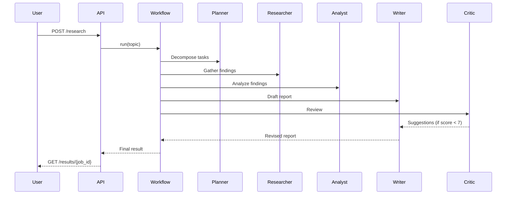

# multi-agent-research

A complete, portfolio-ready multi-agent AI research workflow project.

## Workflow Diagram


## Features
- Multi-agent collaboration with shared state only
- DAG-based workflow execution with conditional revise step
- Real-time event stream over WebSocket
- Extensible agent and tool abstractions
- Mock-first mode for local demos and tests

## Quick Start
### Local
```bash
cp .env.example .env
make install
make test
make serve
```

### Docker
```bash
docker compose up --build
```

## Architecture Deep-Dive
- Docs: `docs/architecture.md`
- Agent patterns: `docs/agent_design.md`
- End-to-end examples: `docs/workflow_examples.md`

## Custom Agents and Tools
- Add agents by subclassing `src/agents/base.py:Agent`
- Add tools by subclassing `src/tools/base.py:Tool`
- Register new agents in `src/orchestrator/router.py`

## Define Workflows
Add YAML files in `workflows/` with steps and outputs.

## API
- `POST /research` with `{ "topic": "...", "workflow": "research_report" }`
- `GET /status/{job_id}`
- `GET /results/{job_id}`
- `GET /workflows`
- `GET /health`
- `WS /ws/{job_id}`

## Sample Output
```markdown
# Research Report
## Executive Summary
This report summarizes key findings from the workflow.
## Key Findings
- Insight 1: ...
## Detailed Analysis
- Compare: ...
## Conclusions
The evidence indicates key trends.
## Sources
- Source: https://example.com
```

## Configuration
See `.env.example` for all supported environment variables.

## Tech Stack
| Component | Technology |
|---|---|
| Language | Python 3.11+ |
| Async | asyncio |
| LLM | OpenAI / Anthropic / Ollama / Mock |
| API | FastAPI + WebSockets |
| UI | Streamlit |
| State | In-memory with Redis-ready config |
| Testing | pytest + pytest-asyncio |
| Container | Docker + docker-compose |

## Contributing
Run `make lint` and `make test` before opening PRs.

## License
MIT
